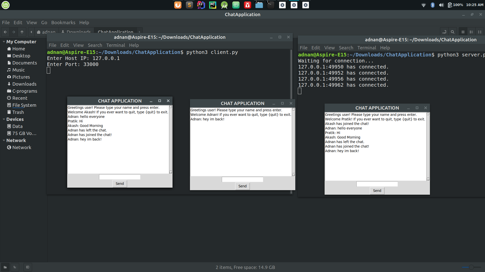
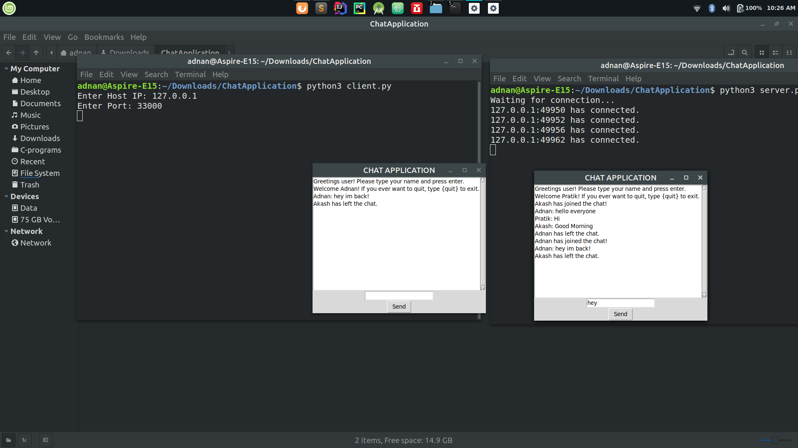

# Chat-Application-Using-Tkinter
This is a chat application which  has been designed using Tkinter library in python for the GUI and have made use of TCP/IP connection for live communication between multiple clients on the same network

## Screenshots

## Introduction

## Getting Started
Download/Clone the files from GitHub to your desired directory on your desktop.

### Prerequisites
* Download and install Python3 on your Windows/Ubuntu/MacOS. (https://www.python.org/downloads/)
Optional: Install Tkinter python library on your machine if its giving an error. (https://tkdocs.com/tutorial/install.html)

### Run the Application
1. Open a terminal in the *current directory* where you have downloaded this repository and type:
`python3 server.py`
2. Open a new terminal in the same directory and type: `python3 client.py`
3. Enter your PC's IP Address which can be checked by running `ipconfig` or `ifconfig` in the terminal. Enter the port no as `33000`
4. Now enter your name in the chat application GUI which has opened and you are connected with the server.
5. Multiple clients can be added using the above steps starting from step 2 and you can chat between multiple clients on the same network seamlessly.

## References

* https://www.geeksforgeeks.org/multithreading-python-set-1/?ref=rp
* https://www.geeksforgeeks.org/socket-programming-multi-threading-python/?ref=rp
* https://www.javatpoint.com/python-tkinter
* https://www.tutorialspoint.com/python/python_gui_programming.htm

